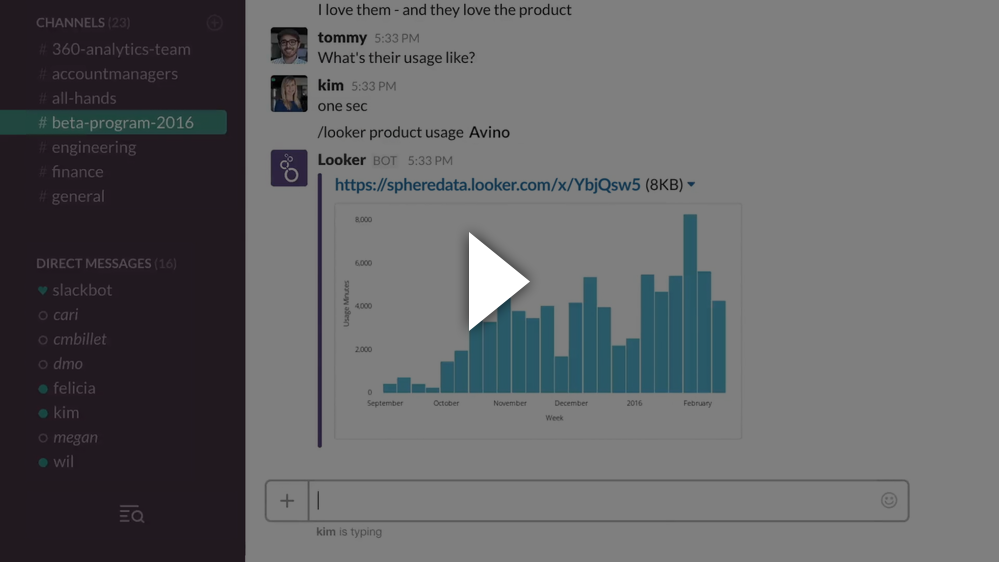

# Lookerbot

Lookerbot integrates [Slack](https://slack.com) and [Looker](https://looker.com) to put all your data at your fingertips. 

With Lookerbot, everyone in your company can easily share data and answer questions instantly. Lookerbot can answer questions, send alerts, and more!

[](https://vimeo.com/159130949)

> For a free trial of Looker go to [looker.com/free-trial](https://looker.com/free-trial).

### Features

Detailed information on how to interact with Lookerbot [can be found on Looker Discourse](https://discourse.looker.com/t/using-the-lookerbot/2302).

### Requirements

- [Looker](https://looker.com) 4.12 or later
  - The "PDF Download & Scheduling and Scheduled Visualizations" Labs feature in Looker must be enabled to display chart images
- A web server capable of running [Node.js](https://nodejs.org/) applications to deploy the bot application to
  - [Node.js](https://nodejs.org/) 6.10.3 is required
  - [Yarn](https://yarnpkg.com/) is required
- (optional) To display chart images, credentials for a supported storage service:
  - [Amazon S3](https://aws.amazon.com/s3/) account, bucket, and access keys
    - [Documentation](https://docs.aws.amazon.com/AmazonS3/latest/gsg/CreatingABucket.html)
    - The access keys need the `s3:PutObjectAcl` permission.
  - [Microsoft Azure Storage](https://azure.microsoft.com/en-us/services/storage/) account and access key
      - [Documentation](https://azure.microsoft.com/en-us/documentation/articles/storage-introduction/)
  - [Google Cloud Storage](https://cloud.google.com/storage/) account and credentials
      - [Documentation](https://cloud.google.com/storage/docs/)

### Deployment

#### Create a new bot in Slack

1. Go to https://api.slack.com/apps and create a new app. We call it **Looker** but it's up to you.
2. Choose "Bot Users" and click "Add a bot user".
3. Create a username for your Lookerbot. We use **@looker** but it's up to you.
4. Under settings, choose "Install App", then "Install App to Team" and authenticate.
5. Copy the Bot User OAuth Access Token (you'll need this later)
6. Under "Basic Information", you can add an icon and description for Lookerbot. [Here's the icon we use](looker-bot-icon-512.png).
> By default, Slack Apps are internal to your team. Don't "distribute" your Slack App – that will make it available to all Slack users in the world.


#### Heroku Deployment

[](https://heroku.com/deploy?template=https://github.com/looker/looker-slackbot/tree/master)

The quickest way to deploy the bot is to use Heroku's one-click deploy button, which will provision a server for your bot. This will prompt you to give the app a unique name, add the Slack API key and configure all of the required variables (see "Environment Variables" below).

Once the environment variables have been set and the server has been deployed, the bot should be ready to go! You can also optionally [configure slash commands](#configuring-slash-commands).

#### Manual Deployment

The bot is a simple Node.js application. The application needs to be able to reach both your Looker instance's API and Slack's API. If you have a self-hosted instance of Looker, be sure to open up port 19999 (or your `core_port`) in order to accesss the Looker API.

#### Environment Variables

The bot is configured entirely via environment variables. You'll want to set up these variables:

- `SLACK_API_KEY` (required) – This is where you'll put the "Bot User OAuth Access Token". You can get in the Slack app under "Install App".

- `LOOKER_URL` (required) – The web url of your Looker instance.

- `LOOKER_API_BASE_URL` (required) – The API 3.0 endpoint of your Looker instance. In most cases, this will be the web url followed by `:19999/api/3.0` (replace `19999` with your `core_port` if it is different).

- `LOOKER_API_3_CLIENT_ID` (required) – The API 3.0 client ID for the user you want the bot to run as. This requires creating an API 3.0 user or an API 3.0 key for an existing user in Looker.

- `LOOKER_API_3_CLIENT_SECRET` (required) – The API 3.0 client secret for the user you want the bot to run as. This requires creating an API 3.0 user or an API 3.0 key for an existing user in Looker.

- `LOOKER_CUSTOM_COMMAND_SPACE_ID` (optional) – The ID of a Space that you would like the bot to use to define custom commands. [Read about using custom commands on Looker Discourse](https://discourse.looker.com/t/2302).

- `LOOKER_WEBHOOK_TOKEN` (optional) – The webhook validation token found in Looker's admin panel. This is only required if you're using the bot to send scheduled webhooks.

- `SLACK_SLASH_COMMAND_TOKEN` (optional) – If you want to use slash commands or interactive messages with Lookerbot, provide the verification token from the "Basic Information" section of the app settings. This is how the bot will verify the integrity of incoming slash commands.

- `PORT` (optional) – The port that the bot web server will run on to accept slash commands. Defaults to `3333`.

If you'd like to put these configuration variables on the filesystem instead, you can place them in a `.env` file at the root of the project as well. Environment variables will take precedence over `.env` settings if both are present.

### Tweaking Behavior

There are a couple environment variables that can be used to tweak behavior:

[//]: # "- `LOOKER_SLACKBOT_EXPAND_URLS` – Set this to `true` to have the bot expand Link and Share URLs in any channel the bot is invited to."

- `LOOKER_SLACKBOT_LOADING_MESSAGES` – Set this to `false` to disable posting loading messages.

- `LOOKERBOT_DATA_ACTIONS_IN_MESSAGES` – Set this to `false` to disable making data action buttons available to Slack users.

##### (optional) Storage Services for Visualization Images

###### Amazon S3

- `SLACKBOT_S3_BUCKET` (optional) – If you want to use Lookerbot to post visualization images, provide an Amazon S3 bucket name.

- `SLACKBOT_S3_BUCKET_REGION` (optional) – If you want to use Lookerbot to post visualization images, provide an Amazon S3 bucket region. Defaults to `us-east-1`.

- `AWS_ACCESS_KEY_ID` (optional) – If you want to use Lookerbot to post visualization images, provide an Amazon S3 access key that can write to the provided bucket.

- `AWS_SECRET_ACCESS_KEY` (optional) – If you want to use Lookerbot to post visualization images, provide an Amazon S3 secret access key that can write to the provided bucket.

###### Microsoft Azure

- `AZURE_STORAGE_ACCOUNT` (optional) - If you want to use Microsoft Azure Storage to store visualization images posted by Lookerbot, provide the name of your Azure Storage account.

- `SLACKBOT_AZURE_CONTAINER` (optional) - If you want to use Microsoft Azure Storage to store visualization images posted by Lookerbot, provide the name of the container within your Azure Storage account that you wish to use.

- `AZURE_STORAGE_ACCESS_KEY` (optional) - If using Microsoft Azure Storage to store visualization images posted by Lookerbot, provide an access key that can write to the provided Azure Storage account and container.

###### Google Cloud Storage

- `GOOGLE_CLOUD_BUCKET` (optional) - If you want to use Google Cloud to store visualization images posted by Lookerbot, provide the name of your bucket.

If Lookerbot is running on Google Compute Engine, [no further information should be needed if the approprate API scopes are set up](https://github.com/GoogleCloudPlatform/google-cloud-node#on-google-cloud-platform).

Otherwise, you can provide credentials directly:

- `GOOGLE_CLOUD_PROJECT` (optional) - If you want to use Google Cloud to store visualization images posted by Lookerbot, provide the name of your project.

- `GOOGLE_CLOUD_CREDENTIALS_JSON` (optional) - If using Google Cloud to store visualization images posted by Lookerbot, provide the content of the credentials JSON file you got from the Google Cloud website.

##### Self-signed or invalid certificates

If your Looker instance uses a self-signed certificate, Lookerbot will refuse to connect to it by default.

Setting the `NODE_TLS_REJECT_UNAUTHORIZED` environment variable to `0` will instruct Lookerbot to accept connections with invalid certificates. Please ensure you have thoroughly evaluated the security implications of this action for your infrastructure before setting this variable.

This should only impact on-premise deployments of Looker. Do not set this environment variable if Looker hosts your instance.

##### Connecting the bot to multiple Looker instances

If you would like the bot to connect to multiple instances of Looker, then you can configure the bot with the `LOOKERS` environment variable. This variable should be JSON array of JSON objects, each representing a Looker instance and its authentication information.

The JSON objects should have the following keys:

- `url` should be the web url of the instance
- `apiBaseUrl` should be the API 3.0 endpoint
- `clientID` should be the API 3.0 client ID for the user you want the bot to run as
- `clientSecret` should be the secret for that API 3.0 key
- `customCommandSpaceId` is an optional parameter, representing a Space that you would like the bot to use to define custom commands.
- `webhookToken` is an optional parameter. It's the webhook validation token found in Looker's admin panel. This is only required if you're using the bot to send scheduled webhooks.

Here's an example JSON that connects to two Looker instances:

```json
[{"url": "https://me.looker.com", "apiBaseUrl": "https://me.looker.com:19999/api/3.0", "clientId": "abcdefghjkl", "clientSecret": "abcdefghjkl"},{"url": "https://me-staging.looker.com", "apiBaseUrl": "https://me-staging.looker.com:19999/api/3.0", "clientId": "abcdefghjkl", "clientSecret": "abcdefghjkl"}]
```

The `LOOKER_URL`, `LOOKER_API_BASE_URL`, `LOOKER_API_3_CLIENT_ID`, `LOOKER_API_3_CLIENT_SECRET`, `LOOKER_WEBHOOK_TOKEN`, and `LOOKER_CUSTOM_COMMAND_SPACE_ID` variables are ignored when `LOOKERS` is set.

##### Running the Server

To run the server:

1. Ensure Node.js is installed
2. `yarn install` to install dependencies
3. `yarn start` to start the bot server. The server will run until you type `Ctrl+C` to stop it.

The included `Procfile` will also allow you to run the app using [foreman](https://github.com/ddollar/foreman) or [node-foreman](https://github.com/jeffjewiss/node-foreman). These libraries also provide easy ways of creating scripts for use with `upstart`, `supervisord`, and `systemd`.

### Configuring Slash Commands

Slash commands are not required to interact with the bot. You can DM the bot directly or mention the bot like:

> @looker help

and use all the functionality.

However, Slash commands are a bit friendlier to use and allow Slack to auto-complete so you'll probably want to set those up.

1. Go to https://api.slack.com/apps and find your app.
2. Choose "Slash Commands" and click "Create New Command".
3. Create a command to use for the Looker bot. We use **/looker** but it's up to you.
4. Set the URL to wherever you have your bot server hosted (if you used Heroku to set up the server, this will be the unique app name that you chose) . The path to the slash command endpoint is `/slack/receive`, so if your server is at `https://example.com`, the URL would be `https://example.com/slack/receive`.
5. Under settings, choose "Install App" again, then "Reinstall App" and authenticate.
6. Under "Basic Information", grab the verification token. You'll use this to set the `SLACK_SLASH_COMMAND_TOKEN` environment variable.

### Scheduling Data to Slack

You can use the bot to send scheduled Looks to Slack.

1. Click "Schedule" on a Look
2. Set "Destination" to "Webhook"
3. Leave "Format" set to default. The format selection is ignored.
4. Enter the webhook URL of the server you set up.

  - Post to public channels `/slack/post/channel/my-channel-name`
    - (Lookerbot will need to be invited to this channel to post in it.)
  - Post to private groups `/slack/post/group/my-channel-name`
    - (Lookerbot will need to be invited to this group to post in it.)
  - To direct message a user `/slack/post/dm/myusername`

  These URLs are prefixed with the URL of your server. (If you used the Heroku deployment, this will be the unique app name you chose). So, if your server is at `https://example.com` and you want to post to a channel called `data-science`, the URL would be `https://example.com/slack/post/channel/data-science`.

5. You'll need to make sure that the `LOOKER_WEBHOOK_TOKEN` environment variable is properly set to the same verification token found in the Looker admin panel.

### Data Actions

#### Performing Data Actions from Slack

By default, simple data actions will appear in Slack for single value visualizations. Data actions that have forms are not currently supported.

This can be disabled on a per-action basis by using Liquid templating in the action definition to restrict access to certain users. Alternately, the action buttons can be disabled entirely with the bot configuration variable `LOOKERBOT_DATA_ACTIONS_IN_MESSAGES`.

There's a quick additional configuration that's needed to use Data Actions from Slack:

1. Go to https://api.slack.com/apps and find your app.
2. Choose "Interactive Messages" and enable that feature.
3. For the "Request URL", set the URL to wherever you have your bot server hosted (if you used Heroku to set up the server, this will be the unique app name that you chose). The path to for interactive message requests is `/slack/action`, so if your server is at `https://example.com`, the Request URL would be `https://example.com/slack/action`.
4. Configure the Slash Command Token [as described here](#configuring-slash-commands).

#### Sending Slack Messages via Data Actions

The bot server also implements endpoints to allow you to easily send [Data Actions](https://discourse.looker.com/t/data-actions/3573) to Slack.

Here's an example of a few data actions you could implement in your LookML. (Replace `https://example.com` with your bot's hostname.)

To make use of this, you'll need to make sure that the `LOOKER_WEBHOOK_TOKEN` environment variable is properly set to the same verification token found in the Looker admin panel, just like with scheduling data.

```coffeescript
dimension: value {
  sql: CONCAT(${first_name}, ' ', ${last_name}) ;;

  # Let user choose a Slack channel to send to
  action: {
    label: "Send to Slack Channel"
    url: "https://example.com/data_actions"
    form_url: "https://example.com/data_actions/form"
    param: {
      name: "message"
      value: ":signal_strength: I sent a value from Slack: {{rendered_value}}"
    }
  }

  # Send to a particular Slack channel with a preset message
  action: {
    label: "Ping Channel"
    url: "https://example.com/data_actions"
    param: {
      name: "message"
      value: ":signal_strength: I sent a value from Slack: {{rendered_value}}"
    }
    param: {
      name: "channel"
      value: "#alerts"
    }
  }

  # Ask the user for a message to send to a particular channel
  action: {
    label: "Ask a Question"
    url: "https://example.com/data_actions"
    form_param: {
      name: "message"
      default: "Something seems wrong... (add details)"
    }
    param: {
      name: "channel"
      value: "#alerts"
    }
  }

}
```

### Data Access

We suggest creating a Looker API user specifically for Lookerbot, and using that user's API credentials. It's worth remembering that _everyone who can talk to your Lookerbot has the permissions of this user_. If there's data you don't want people to access via Slack, ensure that user cannot access it using Looker's permissioning mechanisms.

Also, keep in mind that when the Looker bot answers questions in Slack _the resulting data moves into Slack and is now hosted there_. Be sure to carefully consider what data is allowed to leave Looker. Slack retains chat message history on their servers and pushes many types of notifications about messages out via other services.

To allow visualizations to appear in Slack, if configured to do so, the bot uploads them as images to Amazon S3 with an extremely long randomly-generated URL. Anyone with this URL can access that image at any time, though it should be extremely difficult to guess.

If you choose to remove the image files from S3, the Slack messages that relied on those images will be blank.

### Running Locally for Development

1. Install [Node.js](https://nodejs.org/en/) on your local machine.
2. Install [Yarn](https://yarnpkg.com/) on your local machine.
3. Add your environment variables to a file called `.env` at the base of the repo.
4. Install dependencies with `yarn install`
5. Run the bot with `yarn start`

### Contributing

Pull Requests are welcome – we'd love to have help expanding the bot's functionality.

If you have any trouble with the bot, please open an issue so we can help you out!
